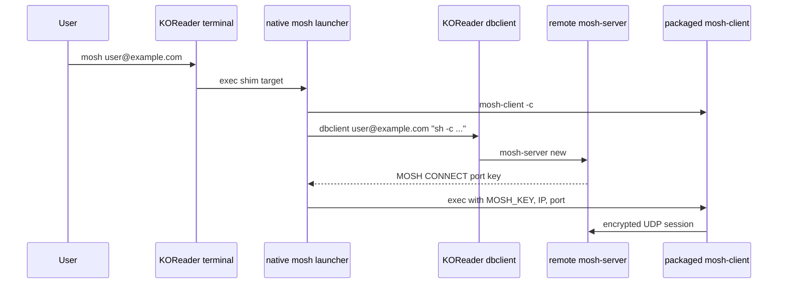

# Architecture

`koreader-mosh` has three runtime pieces:

1. `mosh.koplugin` adds a KOReader tools-menu entry and safely installs a
   terminal shim named `mosh` into `TERMINAL_DATA/scripts`.
2. The `mosh` native launcher replaces upstream `scripts/mosh.pl`.
3. The packaged `mosh-client` runs the UDP session after remote startup.

Connection flow:

The launcher captures only `dbclient` stdout. `dbclient` stderr and stdin remain
attached to the terminal so password and host-key prompts stay interactive.

The launcher parses exactly one valid `MOSH CONNECT <port>
<22-character-base64-key>` line, rejects malformed or duplicate control
messages, and never prints the session key.

After successful startup, the launcher uses `exec` to replace itself with
`mosh-client`. This matters for Kobo sleep/wake: the live process attached to
KOReader's terminal is the actual Mosh client, so it can continue the encrypted
UDP session after the device wakes and Wi-Fi returns. A wrapper process is not
left behind.
